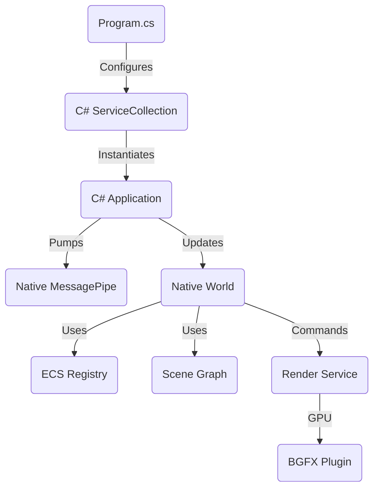

# 🛰️ Kernel Engine — Evolution Roadmap (Hostless Architecture)

> Refactoring the engine from a centralized "Engine Object" model to a "Pure IoC Kernel" where the Framework/User orchestrates independent Services and a Simulation World.

---

# 1. Architectural Vision

### 🏛️ The "Hostless" Kernel
*   **The Engine object (`ke_engine`) is deleted.** It was a redundant middleman.
*   **Systems are renamed to Services.** They are passive tools (Renderer, Window, Logger).
*   **World is the Simulation Master.** It receives Service pointers via Dependency Injection (Descriptors).
*   **Framework is the Shell.** It manages the loop and high-level orchestration.

### 🧩 Everything is an Interface
*   C# layer will interact exclusively with interfaces (`IWorld`, `IScene`, `INode`, `IRenderer`, `IAllocator`).
*   Implementations (C Core or Plugins) are optional and swappable.

---

# 2. Roadmap & Tasks

### ✅ Milestone 1: Core Architecture Cleanup (Current Task)
- [ ] Rename `ke_system` to `ke_service` in C Core.
- [ ] Delete `ke_engine` and `ke_engine_tick` from C and C#.
- [ ] Update `ke_world_descriptor` to receive `ke_render` and `ke_window` directly.
- [ ] Refactor C# `Application` to orchestrate `MessagePipe` and `World` without an `Engine` middleman.
- [ ] **Validation**: `SimpleFrameworkWorldApp` must run successfully.

### 🏗️ Milestone 2: The Interface Era
- [ ] Create `IWorld`, `IScene`, `INode` interfaces in `KernelEngine.Core`.
- [ ] Refactor existing C# classes to implement these interfaces.
- [ ] Update `Application` and `Program.cs` to use only interfaces.
- [ ] **Validation**: Decoupling check (Ensure no direct implementation instantiation in user code).

### 🏷️ Milestone 3: The Kernel Rebranding
- [ ] Rename `/src/c/core` to `/src/c/kernel`.
- [ ] Update all C includes and CMake targets (`ke_core` -> `ke_kernel`).
- [ ] Rename C# project `KernelEngine.Core` to `KernelEngine.Kernel`.
- [ ] Update namespaces and project references.
- [ ] **Validation**: Full build and execution of all examples.

---

# 3. Component Interaction Map (New)

# 4. Success Criteria
*   Zero occurrences of `Engine` class/struct.
*   All user-facing C# code uses `interfaces`.
*   Project structure clearly separates the `Kernel` (laws) from `Services` (tools).
